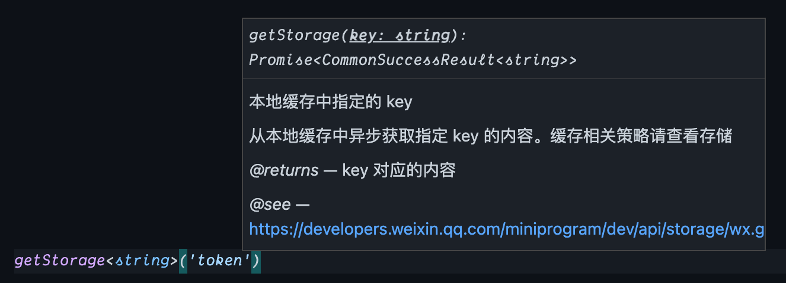

# refined-minapp-sdk

A helper wrapped on the top of wechat-minapp sdk to make it more developer-friendly.

## Principles

- Typed all api based on TypeScript
- Promisify all api
- Flatten key params like `wx.getStorage({ key: '' })` => `wx.getStorage('key')`
- Replace wx error with standard built-in `Error` object

## Example

Original:

```js
wx.getStorage({
  key: 'local_token',
  success: (res) => {
    console.log(res.data)
  },
  fail: (err) => {
    console.error(err.errMsg)
  },
})
```

Now:

```js
wx.getStorage('local_token')
  .then((res) => {
    console.log(res)
  })
  .catch((err) => {
    console.error(err.message)
  })
```

### With VSCode IntelliSense



## TODO

- [ ] 基础
- [ ] 路由
- [ ] 跳转
- [ ] 转发
- [ ] 界面
- [ ] 网络
- [ ] 支付
- [ ] 数据缓存
- [ ] 数据分析
- [ ] 画布
- [ ] 媒体
- [ ] 位置
- [ ] 文件
- [ ] 开放接口
- [ ] 设备
- [ ] Worker
- [ ] WXML
- [ ] 第三方平台
- [ ] 广告
